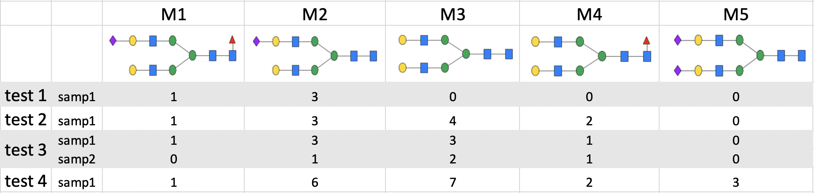

# GlyCompareCT
GlyCompareCT is a Python-based command-line tool available at https://github.com/yuz682/GlyCompareCT. The command-line implementation wraps the existing python package (GlyCompare v1.1.3 https://github.com/LewisLabUCSD/GlyCompare) to increase accessibility by simplifying the user interface. A conda environment yml file is provided for stable installation. Executable files are also available on Zenodo (https://zenodo.org/record/6342395#.YtywB-zMKw0) for Windows (tested on Windows 10, Core i7), Linux (tested on 18.04.6 LTS and CentOS Linux 7 Core), and Mac OS with Intel chip (macOS 12.1, Core i7). A Mac M1 chip version is under development. 

To simplify the user experience, GlyCompareCT limits mandatory user inputs and provides extensive and informative input and run errors. Input files and parameters are described below with additional detail and examples accessible through github. 

Mandatory inputs include a glycan abundance table (absolute or relative abundance with rows/columns as samples/glycans; -a <path/to/abundance>) and a glycan annotation table (-v <path/to/annotation>); both tables should be comma separated values files (CSV). The glycan annotation table contains two columns, (1) glycan name (matching the glycan abundance table column names), and (2) glycan structures or composition. Glycan structures can be described with glycoCT30, WURCS31, IUPAC-extended32,33, Linear-Code34, or GlyTouCan35; indicate the nomenclature used with the -p flag (e.g., -p iupac). Glycans are converted to glypy objects from different nomenclatures to proceed36. Glycan compositions are represented as monosaccharide(occurrence) (e.g. HexNAc(2)Hex(5)). From structural or compositional glycan abundance, GlyCompareCT decomposes glycans to substructures, calculates substructure abundance, optionally normalizes (add -b), and identifies a minimal set of glycomotifs. 

Optional parameter defaults include no input normalization (-n none), integer substructure multiplier (-m integer), no output substructure normalization (exclude -b), and epitope mode (-r epitope). Alternatively, input data normalization can be min-max (-n min-max) or probabilistic quotient37,38 (-n prob-quot) normalized. The substructure multiplier (-m) indicates the number of times a substructure should be counted. The binary or integer multiplier(-m binary/integer) indicates if glycan abundance should be scaled by substructure occurrence existance or count respectively (see Interpretation). . The output substructure abundance matrix can also be relative abundance-normalized (-b). Finally, the user can specify a root for substructure network traversal during motif-selection. The user-specified network root for motif-extraction is either all monosaccharides (-r epitope) or a specified substructure (-r N/O/lactose/custom). 

GlyCompareCT outputs the glycomotif abundance table and optionally a glycomotif abundance clustermap to enable exploration in differential glycomotif abundance. The glycomotif abundance table denotes the abundance of the glycomotifs extracted from input glycoprofiles. Rows represent glycomotifs written as <[S/L]i> where S or L denote the structural and linkage-specific references respectfully and i indicates the index in the local reference glycomotif vector (GlyCompareCT/reference if using the python script; glyCompareCT_exe_<platform>/reference if using executables). Note that local references will be amended to include previously un-indexed substructures; the github reference will be versioned by date and updated occasionally to integrate new substructures. Column names correspond to glycoprofile names, consistent with the input glycan abundance table. 

## Citation

Bao, Bokan, Benjamin P. Kellman, Austin WT Chiang, Yujie Zhang, James T. Sorrentino, Austin K. York, Mahmoud A. Mohammad, Morey W. Haymond, Lars Bode, and Nathan E. Lewis. "**Correcting for sparsity and interdependence in glycomics by accounting for glycan biosynthesis.**" Nature communications 12, no. 1 (2021): 1-14. https://doi.org/10.1038/s41467-021-25183-5

## Installation

First, please make sure you have `conda` installed. Version recommendation: conda 4.9.2 and later versions. 
- Install `conda` on Windows: https://docs.conda.io/projects/conda/en/latest/user-guide/install/windows.html
- Install `conda` on Mac OS: https://docs.conda.io/projects/conda/en/latest/user-guide/install/macos.html

Please ```git clone``` the main branch to your target local directory. 
```bash
# get the repo
git clone https://github.com/yuz682/GlyCompareCT.git
# enter the repo
cd GlyCompareCT
```

All dependencies required to run GlyCompareCT can be installed using `environment.yml`. A new conda environment is created with all dependencies installed. This step will take a while (10 - 15 minutes). 
```bash
# Create the environment with all required dependencies installed.
conda env create -f environment.yml
```

Activate the new environment `glycompareCT`. Then the preprocessing is all done.
```bash
# Activate conda environment
conda activate glycompareCT
```

## Executables

Executables for Window, MacIntel, and Linux can be downloaded from the [release](https://github.com/yuz682/GlyCompareCT/releases/tag/glycoinformatics) or [zenodo](https://zenodo.org/record/6342395#.YtywB-zMKw0). The binary file is glyCompareCT (or glyCompareCT.exe). To use more conveniently, you can export the path to PATH variable by 

```bash
export PATH="<path>/<to>/<glyCompareCT>/<directory>":$PATH
```
then
```bash
source ~/.bashrc
```

## User manual

Please refer to the [GlyCompare wiki](https://github.com/LewisLabUCSD/GlyCompare/wiki) regarding input file format and more details about input parameters. Please ignore some inconsistent wording as the wiki was written for a web app. 

### Quick start

#### Retreive example data
```bash
git clone https://github.com/LewisLabUCSD/GlyCompare.git 
```
Glycopare decomposition of structural, linkage-specific HMO data with no normalization, 2 cores, integer substructure counting, epitope-based motif extraction
```bash
python glyCompareCT.py structure \
  -a GlyCompare/example_data/paper_hmo/source_data/abundance_table.csv \
  -v GlyCompare/example_data/paper_hmo/source_data/annotation.csv \
  -o output_hmo/ -p glycoCT -c 2 \
```
Glycopare decomposition of structural, linkage-specific HMO data with Probabilistic Quotient normalization, 2 cores, binary substructure counting, lactose-based motif extraction
```bash
python glyCompareCT.py structure \
  -a GlyCompare/example_data/paper_hmo/source_data/abundance_table.csv \
  -v GlyCompare/example_data/paper_hmo/source_data/annotation.csv \
  -o output_hmo/ -p glycoCT -n prob_quot \
  -m binary -c 2 -r lactose
```

#### Naive samples

Simple simulated samples can be retrieved from `GlyCompareCT/Naive samples/`. There are 4 pairs of test samples.

```bash
cd Naive\ samples/

python glyCompareCT.py structure \
  -a test1_abd.csv \
  -v test1_var.csv \
  -o test1 -p glycoCT -b \
  -m integer -c 2 
```

Inputs:


Outputs:


### Table annotation

Annotation format will update the Glytoucan ID column in the previously generated motif annotation table or table with the same format. 

```bash
python glyCompareCT.py annotate -n <ANNOTATION TABLE>
```
  
  
### Structure data
```bash
python glyCompareCT.py structure -a <ABUNDANCE TABLE> -v <GLYCAN ANNOTATION> 
-o <OUTPUT_DIRECTORY> -p <GLYCAN_DATA_TYPE> [-n <NORMALIZATION_MODE>, 
-m <SUBSTRUCTURE_ABUNDANCE_MULTIPLIER>, -c <NUMBER_OF_CORES>, -r <ROOT>, 
-cr <CUSTOM_ROOT>, -d, -s, -b, -i]
```

Required arguments:

| Parameter                 | Description  |	
| :------------------------ |:-------------|
| -a, --abundance	        |	The file directory to the abundance table, in csv format
| -v, --var_annot         |  The file directory to the glycan annotation table, in csv format
| -o, --output 	       |	The directory to save the outputs, folder
| -p, --syntax 		     |  Glycan data type, choose from <'glycoCT', 'iupac_extended', 'linear_code', 'wurcs', 'glytoucan_id'>

Optional arguments: 

| Parameter                | Default       | Description   |	
| :------------------------------------ |:-------------:| :-------------|
| -e, --share 	       |	'private'        |  Either run locally or register the output motif structures to Glytoucan. Choose from <'private', 'register'>.<br>'private': run GlyCompareCT locally without fetching glytoucan ID and register output motifs to Glytoucan.<br>'register': Fetch glytoucan ID to output motif annotation table and register any output motifs without glytoucan ID to Glytoucan. Needs to specify Glytoucan contributor ID and API_key. 
| -C, --Contributor_ID        |  ''            |  User's Glytoucan contributor ID. Can be retrieved at Glytoucan after signing up. Required in `-e register` mode. 
| -A, --API_key        |  ''            |  User's Glytoucan API key. Can be retrieved at Glytoucan after signing up. Required in `-e register` mode. 
| -s, --no_linkage 	       |	None        |  Add this parameter if the input glycans don't have linkage information. The default assumes linkage information inclusion.
| -c, --core        |  1            |  The number of cores to use
| -n, --norm 	       |  'none'	    |  Input glycans normalization within each glycoprofile, choose from <'none', 'min-max', 'prob-quot'>.<br>'none': no normalization;<br>'min-max': each element x is set to (x - min) / (max - min);<br>'prob-quot': A commonly seen normalization method in biological data described in [_Dieterle et al. 2006_](https://pubs.acs.org/doi/10.1021/ac051632c)
| -b, --no_sub_norm         |  None        |  Add this parameter to keep the absolute value of the substructure abundance. If not set, the substructure will be normalized by sum.
| -m, --multiplier 		     |  'integer'   |  Substructure abundance multiplier, choose from <'binary', 'integer'>.<br>'binary': 1 if the substructure exists in the glycan, 0 if not;<br>'integer': the occurrence of the substructure in the glycan.
| -r, --root		     |  'epitope'    |  The root substructure of the substructure network, choose from <'epitope', 'N', 'O', 'lactose', 'custom'>.<br>"epitope": run every possible monosaccharide is a root;<br>'N': the root for N-glycan, **GlcNAc**;<br>'O': the root for O-glycan, **GalNAc**;<br>'lactose': set the root as lactose, **Gal(b1-4)Glc**;<br>'custom': set custom root. You need to write your custom root in glycoCT format to a txt file and specify the file directory in -cr. 
| -cr, --custom_root 	     |  ''           |  The file directory to the txt file containing the custom root in glycoCT format. Only specify this if -r is set to 'custom'. 
| -d, --heatmap 	     |  None         |  Add this parameter if you want to draw the cluster map based on the output motif abundance table.
| -i, --ignore 	     |  None         |  Add this parameter if you want to ignore unrecognized glycan structures and proceed the rest.


### Composition data
```bash
python glyCompareCT.py composition -a <ABUNDANCE TABLE> -v <GLYCAN ANNOTATION> 
-o <OUTPUT_DIRECTORY> [-n <NORMALIZATION_MODE>, -i]
```

Required arguments:

| Parameter                 | Description  |	
| :------------------------ |:-------------|
| -a, --abundance	       |	The file directory to the abundance table, in csv format
| -v, --var_annot         |  The file directory to the glycan annotation table, in csv format
| -o, --output 	       |	The directory to save the outputs, folder

Optional arguments: 

| Parameter                 | Default       | Description   |	
| :------------------------ |:-------------:| :-------------|
| -n, --norm 	       |  'none'	    |  Input glycans normalization within each glycoprofile, choose from <'none', 'min-max', 'prob-quot'>.<br>'none': no normalization;<br>'min-max': each element x 
| -i, --ignore 	     |  None         |  Add this parameter if you want to ignore unrecognized glycan compositions and proceed the rest.

